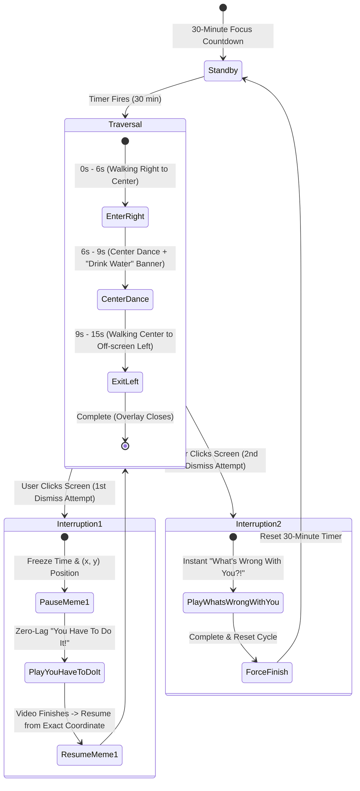

# 🌊 LOCKIN — Creative Water Reminder

> **An un-ignorable, culturally iconic desktop health companion engineered to destroy dehydration and screen fatigue for developers, creators, and power users.**

[](#testing)
[](#technology-stack)
[](#technology-stack)
[](#technology-stack)
[](#installation)
[](#license)

---

## 🎯 Why This Project Exists & Why It Matters

### The Problem: The Flow-State Dehydration Trap
When software engineers, designers, and gamers enter deep flow, the brain's interoceptive awareness dims. You can spend 4 to 8 continuous hours staring at code or canvases without taking a single sip of water. 

- **Cognitive Decline**: Clinical research proves that as little as **1% to 2% dehydration** leads to quantifiable drops in working memory, executive function, reaction time, and alertness.
- **Physical Toll**: Chronic under-hydration triggers tension headaches, dry eyes, neck stiffness, and afternoon fatigue crashes.
- **The Notification Failure**: Conventional water reminder apps rely on subtle system tray toasts, delicate chime sounds, or passive mobile badges. When you are debugging or shipping code, your brain quickly builds **notification blindness** — you dismiss the toast without even reading it.

### The Solution: Culturally Powered, Un-ignorable Dopamine Interventions
**LOCKIN** replaces passive, ignorable pings with dynamic, transparent desktop meme interventions. Instead of an annoying corporate pop-up, a transparent, photorealistic meme character walks across your entire multi-monitor screen, dances, reveals an unfolding reminder banner, and gently commands you to drink water.

If you attempt to close or bypass the reminder prematurely, LOCKIN's multi-tier interruption engine reacts immediately with hilarious, pinpoint meme roasts that make staying hydrated memorable, fun, and impossible to forget.

---

## 🎭 The 3-Meme Choreography & Use-Case Architecture

LOCKIN's water reminder engine is engineered with a strict 3-tier sequence to balance playful motivation with firm accountability.



### 1. Meme 1: The Traversal (Continuous 15-Second Choreography)
- **Asset**: `water_ravi_final.webm` (Transparent VP9 with native Alpha channel).
- **FPS & Sync**: Driven by a high-precision `requestAnimationFrame` loop tied directly to hardware video `currentTime`.
- **Choreography Timeline**:
  - `0.0s – 6.0s (Entry)`: Enters smoothly from beyond the right viewport edge ($X = 105vw$) and walks rhythmically toward the center of your screen ($X = 50vw$).
  - `6.0s – 9.0s (Center Stage & Banner)`: Anchors at screen center. At `5.8s – 8.8s`, an animated glassmorphic banner unrolls beneath the character: **"Drink Water Now 💧"**.
  - `9.0s – 15.0s (Exit)`: Resumes striding leftward, traversing all the way off-screen ($X = -25vw$). At 15 seconds, the overlay cleanly unmounts and closes.

### 2. Meme 2: The 1st Interruption ("You Have To Do It!")
- **Asset**: `you_have_to_do_it.webm` (Hardware-accelerated fast decode).
- **Trigger**: The user clicks anywhere on the transparent overlay during Meme 1 in an attempt to dismiss or evade the reminder.
- **Mechanism**:
  1. Instantly freezes Meme 1 at its exact sub-second video timestamp and screen pixel offset $(x, y)$.
  2. Spawns an authoritative, crystal-clear video popup centered with a dark backdrop: **"You Have To Do It!"**.
  3. Upon video completion, Meme 1 smoothly unpauses and resumes its walk from the exact coordinate and frame where it was paused.

### 3. Meme 3: The 2nd Interruption ("What's Wrong With You?!")
- **Asset**: `whats_wrong_with_you.webm` (Hardware-accelerated fast decode).
- **Trigger**: The user clicks a second time during the same reminder session.
- **Mechanism**:
  1. Instantly launches the ultimate roast video clip: **"What's Wrong With You?!"**.
  2. When finished, concludes the reminder sequence, increments the session hydration metrics, restarts the 30-minute recurring countdown loop, and hides the overlay.

---

## ⚡ Technical Innovations

### 🪟 Invisible Native Desktop Canvas (Electron Screen-Saver Layer)
- Configured with `transparent: true`, `frame: false`, `alwaysOnTop: true`, `level: 'screen-saver'`, and `skipTaskbar: true`.
- Allows the meme character to render directly over your IDE, browser, terminal, or full-screen applications without an opaque window border or gray background box.

### 🎬 Native Alpha-Channel VP9 WebM Pipeline
- Custom-encoded VP9 video with native 8-bit alpha transparency channels.
- Employs `transform: translateZ(0)` and `will-change: transform, opacity` to guarantee buttery 60 FPS GPU-accelerated compositing with zero CPU spiking.

### 📡 Low-Latency Inter-Window IPC (BroadcastChannel)
- Seamless communication between the main **Dashboard Window** and the independent **Desktop Overlay Window** powered by the Web Standard `BroadcastChannel("lockin_water_channel")`.
- Guarantees zero-lag manual test triggers, timer resets, and state hydration across processes.

### 🛡️ Autoplay-Policy Hardened
- Starts the Electron runtime with `--autoplay-policy=no-user-gesture-required`.
- Eliminates Chromium's default background media restrictions so sound and animation fire reliably even when the overlay window doesn't hold input focus.

---

## 🛠️ Technology Stack

| Layer | Technology | Purpose |
| :--- | :--- | :--- |
| **Desktop Runtime** | Electron 33.x | Multi-window lifecycle, transparent overlay, native display bounds |
| **Frontend Framework** | React 19 + TypeScript | UI component structure, type safety, modular architecture |
| **Styling & Design** | Tailwind CSS + Framer Motion | Sleek dark-mode dashboard, fluid entry/exit animations |
| **State Management** | Zustand | Reactive timer state machine, interruption handling, persistence |
| **Local Database** | Dexie.js (IndexedDB / SQLite) | Offline history, daily water tracking, streak records |
| **Build & Bundler** | Vite 8.x + Inno Setup 6 | Instant HMR, tree-shaking, production 64-bit Windows EXE installer |
| **Automated Testing** | Vitest 4.x | Unit and integration testing across timer, overlay, and behavior logic |

---

## 🚀 Getting Started

### Prerequisites
- **Windows 10 / 11 (64-bit)**
- **Node.js**: v18.0.0 or higher
- **npm**: v9.0.0 or higher
- *(Optional for packaging installer)*: [Inno Setup 6](https://jrsoftware.org/isinfo.php)

### 1. Clone the Repository
```bash
git clone https://github.com/tanmayybuilds/Creative_Water_reminder.git
cd Creative_Water_reminder
```

### 2. Install Dependencies
```bash
npm install
```

### 3. Run in Development Mode
Launch the Vite development server along with the Electron desktop app:
```bash
npm run dev
```

---

## 🧪 Testing

The repository features comprehensive automated test coverage validating state transitions, timer sequences, and overlay rendering.

```bash
# Run all automated test suites
npm test

# Run tests with UI watcher
npm run test:watch
```

**Test Suites Include:**
- `tests/desktopWaterReminder.test.ts` — Full lifecycle of the 30-minute reminder loop, state transitions, and event dispatches.
- `tests/behaviorEngine.test.ts` — User interaction logic and distraction penalty calculations.
- `tests/finalChoice.test.ts` — Choice dialogs and break session interactions.
- `tests/transparentPipeline.test.ts` — WebM transparent format compliance and fallback sanity checks.

---

## 📦 Building the Standalone Windows Installer

To compile the production Vite bundle, assemble the Electron binary runtime, and build the 64-bit Windows Setup Installer (`.exe`):

```bash
npm run build:exe
```

### Build Artifacts:
Upon completion, the distribution artifacts are generated in the `release/` directory:
- **`release/LOCKIN_Setup_x64.exe`**: Complete standalone Windows Setup Wizard with desktop shortcut, start menu entry, and uninstaller.
- **`release/LOCKIN_Windows_x64.zip`**: Portable standalone folder containing `LOCKIN.exe` ready to run without installation.

---

## 📂 Project Structure

```
Creative_Water_reminder/
├── electron/
│   └── main.cjs                # Electron main process (Multi-window & IPC management)
├── installer/
│   └── LockinInstaller.iss     # Inno Setup 6 script definition
├── public/
│   └── memes/
│       └── processed/          # Transparent WebM video assets & interruption clips
├── scripts/
│   └── package_app.cjs         # Automated 3-stage standalone build pipeline
├── src/
│   ├── components/             # Reusable UI widgets, cards, and modals
│   ├── features/
│   │   └── waterReminder/      # Core water reminder store, overlay & controls
│   │       ├── waterReminderStore.ts    # Zustand timer state machine
│   │       ├── waterReminderOverlay.tsx  # Transparent video & interruption UI
│   │       └── waterReminderWidget.tsx   # Dashboard control widget
│   ├── App.tsx                 # Main application entry
│   └── index.css               # Global dark-theme styling
├── tests/                      # Vitest unit & integration test suites
├── package.json                # Project scripts and dependencies
├── vite.config.ts              # Vite bundler configuration
└── README.md                   # Project documentation
```

---

## 🤝 Contributing

Contributions, feedback, and meme submissions are warmly welcome!
1. Fork the Project
2. Create your Feature Branch (`git checkout -b feature/AmazingFeature`)
3. Commit your Changes (`git commit -m 'feat: Add some AmazingFeature'`)
4. Push to the Branch (`git push origin feature/AmazingFeature`)
5. Open a Pull Request

---

## 📄 License

Distributed under the MIT License. See `LICENSE` for more information.

---

<p align="center">
  Crafted with ❤️ and 💧 to keep developers healthy, focused, and locked in.
</p>
